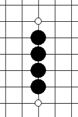
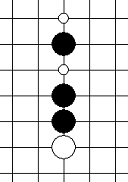
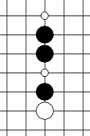
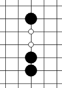
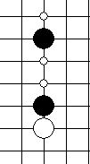
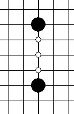

# Gomoku

## 基本介绍

五子棋游戏(Gomoku), GUI通过Qt实现，如图所示：


游戏支持以下模式：
- Single Mode
    双人对战模式，支持在同一台电脑上两人对战。
- Network Mode
    网络对战模式，支持用户通过网络连接对战，只需要知道IP即可。
- AI Mode
    人机对战模式，支持AI对战。

## 棋型确定

| 棋型     | 定义                                                     | 图例                                                         |
| -------- | -------------------------------------------------------- | ------------------------------------------------------------ |
| **长连** | 至少五颗同色棋子连在一起                                 |                  |
| **活四** | 有两个连五点（即有两个点可以形成五），图中白点即为连五点 |                  |
| **冲四** | 有一个连五点                                             |    |
| **活三** | 可以形成活四的三                                         |    |
| **眠三** | 只能够形成冲四的三                                       |           |
| 活二     | 能够形成活三的二                                         |   |
| 眠二     | 能够形成眠三的二                                         |     |
| 死四     | 两头都被封堵的四                                         |                                                              |
| 死四     | 两头都被封堵的三                                         |                                                              |


## 落子估值方式

### 分析：棋子落在哪里最好？

1. 需要考虑落下后会在四个方向各形成什么棋型，是否形成组合棋型，然后进行初步打分；
2. 同时还要考虑落子位置，一般同分情况下越中心的点越好；
3. 可以分析对攻击效果、防守效果、综合效果。

### 初步打分：

就是按照威胁程度给每种棋型打分，在理解棋型后，试验了多组估分方式，最后确定效果最好的一组打分方式如下：

| 棋型（含组合棋型） | 分值   |
| ------------------ | ------ |
| 长连               | 100000 |
| 活4、双冲4、冲4活3 | 10000  |
| 双活3              | 5000   |
| 活3眠3             | 1000   |
| 眠4                | 500    |
| 活3                | 200    |
| 双活2              | 100    |
| 眠3                | 50     |
| 活2眠2             | 10     |
| 活2                | 5      |
| 眠2                | 3      |
| 死4                | -5     |
| 死3                | -5     |
| 死2                | -5     |

再统计在四个方向各形成什么棋型，是否形成组合棋型，取最高分为初步打分的结果。

### 落子位置

根据棋盘分布问题，越中心的点分值应当越高。

```c++
static int[][] position = {
{ 0, 0, 0, 0, 0, 0, 0, 0, 0, 0, 0, 0, 0, 0, 0 },
{ 0, 1, 1, 1, 1, 1, 1, 1, 1, 1, 1, 1, 1, 1, 0 },
{ 0, 1, 2, 2, 2, 2, 2, 2, 2, 2, 2, 2, 2, 1, 0 },
{ 0, 1, 2, 3, 3, 3, 3, 3, 3, 3, 3, 3, 2, 1, 0 },
{ 0, 1, 2, 3, 4, 4, 4, 4, 4, 4, 4, 3, 2, 1, 0 },
{ 0, 1, 2, 3, 4, 5, 5, 5, 5, 5, 4, 3, 2, 1, 0 },
{ 0, 1, 2, 3, 4, 5, 6, 6, 6, 5, 4, 3, 2, 1, 0 },
{ 0, 1, 2, 3, 4, 5, 6, 7, 6, 5, 4, 3, 2, 1, 0 },
{ 0, 1, 2, 3, 4, 5, 6, 6, 6, 5, 4, 3, 2, 1, 0 },
{ 0, 1, 2, 3, 4, 5, 5, 5, 5, 5, 4, 3, 2, 1, 0 },
{ 0, 1, 2, 3, 4, 4, 4, 4, 4, 4, 4, 3, 2, 1, 0 },
{ 0, 1, 2, 3, 3, 3, 3, 3, 3, 3, 3, 3, 2, 1, 0 },
{ 0, 1, 2, 2, 2, 2, 2, 2, 2, 2, 2, 2, 2, 1, 0 },
{ 0, 1, 1, 1, 1, 1, 1, 1, 1, 1, 1, 1, 1, 1, 0 },
{ 0, 0, 0, 0, 0, 0, 0, 0, 0, 0, 0, 0, 0, 0, 0 } };
```

## 棋局估值函数

### 函数描述：

有了落子估值方式后，可以针对某一棋局，分析一定棋盘范围内的各个可落子点的落子估值，将最大综合分作为该棋局的估值。

### 简单智能:

利用估值函数，即可实现简单智能，即只考虑当前局面下的最佳落子点，并落子。

优点是速度快，眼前胜利绝不放过，缺点也是显而易见的，对于埋伏了多步的杀法，这种只顾“近忧”的智能无能为力。因此，就需要搜索算法增加“远虑”。

## 搜索算法

### 极大极小搜索

分析：要想得更远的，棋子落在哪里最好？

1. 在对弈中，可利用棋局估值函数对任何一个局面进行估值，估值越大表明对当前玩家越有利，估分越小则表明越不利；
2.  选择落子时，要考虑对自己第一步越有利的，对对手下一步越不利的，对自己第二步越有利的，以此类推；
3. 这样选择落子时就表现为一棵极大极小搜索树，逐层搜索，对自己轮的层就选最大值的局面，对对手轮就选最小值的局面，直到一定深度。

 但测试后发现该算法速度比较慢，对15×15的棋盘，搜索第一层有15×15=225个结点，第二层就约有15×15×15×15=50625个节点，完全是指数爆炸。

### α-β剪枝算法

在搜索的过程中，实际上有搜索很多点是多余的。经过α-β剪枝，可以极大的减少搜索的数量。在查阅资料的过程中，发现α-β剪枝算法是一个基础而经典的算法，还有很多风格、很多变式，值得深入学习。


## 编译安装

create build director.
```shell
mkdir build
qmake ..
make
```


## 怎么用AI

1. 每次Human下子之后，改变了board的状态，然后AI根据当前的状态，遍历所有的可以下子的点，假设在对应的位置落子，查看棋盘中的模式，对应算出该点的分数，哪个分数大下到哪。